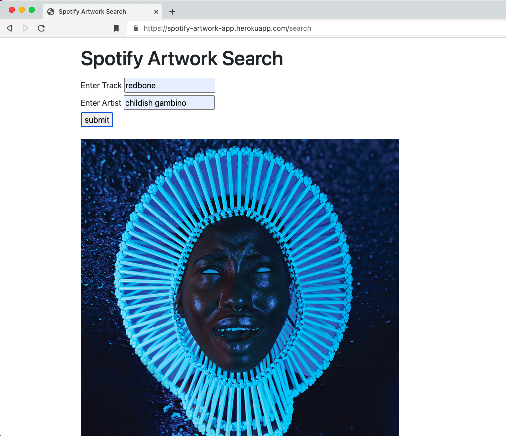

# SPOTIFY ARTWORK APP
A (very) simple app that addresses an annoying feature (bug? oversight?) in Spotify: There's no way to see full size artwork!

This app uses <a href="https://developer.spotify.com/documentation/web-api/">Spotify's API</a> to search for the entered track.




## Requirements
```
pip3 install flask
```
```
pip3 install requests
```
```
pip3 install python-dotenv
```

## Spotify Developer Requirements
You will need a <a href="https://developer.spotify.com/">Spotify for Developers </a> account to use this application.

Once you have a created an account, go to <a href="https://developer.spotify.com/dashboard/applications">your dashboard</a> and click on 'Create an App.'

After you create your app, you will recieve a <client_id> and a <client_secret> - which you can enter in the .env file.

You will also need to create your own <secret_key> in order to use Flask's session. Any random string will do.

Once you have the <client_id>, <client_secret> and <secret_key>, all three can be set in the .env file.  


```bash
# .env
SECRET_KEY = 'your secret key goes here'
CLIENT_ID = 'your spotify client_id goes here'
CLIENT_SECRET = 'your spotify client_secret goes here'
```

## Planned updates(soonish)
- Display a list of results, instead of returning the first result
- More robust error handling
- Sync to user's currently playing tracks, so artwork is automatically updated


